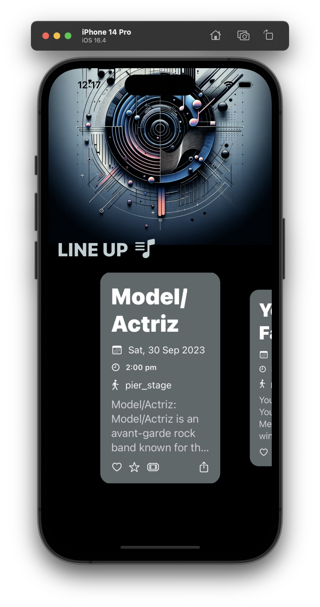

# Festival Lineup App

## Demo

### Sample


### Image



### Video
[Demo Video](./music_line_up.mov)


## Overview
The Festival Lineup App is designed to showcase artists performing at a music festival. The app is built using Swift and SwiftUI, and it adopts the RIBs (Router, Interactor, Builder) architecture pattern to organize and manage its components and flows.

## Pending
Replace ScrolView ForEach with reusable view, right now List view does not support horizontal scrolling. As it's a sample app, this step is skipped

## RIBs Architecture
RIBs (Router, Interactor, Builder) is an architectural pattern that aims to provide a clear separation of concerns and a scalable approach to building complex applications. In this app, the RIBs architecture is implemented as follows:

- **Router**: Responsible for navigation and managing the lifecycle of components in the app.
- **Interactor**: Contains the business logic for each respective part of the application.
- **Builder**: Used to create and assemble the necessary components, injecting dependencies as needed.

## Components

### Builder
- `FestivalLineupBuilder`: Constructs the components for the Festival Lineup feature, including the service, view model, interactor, and router.

### Router
- `FestivalLineupRouter`: Manages the navigation logic for the Festival Lineup feature.

### Interactor
- `FestivalLineupInteractor`: Contains the business logic for the Festival Lineup feature, including data fetching and state management.

### ViewModel
- `FestivalLineupViewModel`: Observable object that holds the state and data for the views, reacting to updates from the interactor.

### View
- `FestivalLineupView`: The main view displaying the festival lineup, observing changes from the `FestivalLineupViewModel`.

### Services
- `FestivalLineupService`: Handles network requests to fetch the lineup data.

## Usage

Run
```python3 -m http.server```
from the root of the project folder. This would use `fest_lineup.json` as the data.
You can update the NetworkConfig file if base url is different from "http://localhost:8000/"

Next - run the xcode project


## Network Layer
The network layer is managed by `NetworkManager`, which performs requests and handles responses. It integrates with the `FestivalLineupService` to fetch data.

## Theme and Styling
The app's visual theme is managed by `Theme`, which provides a centralized way to manage colors and font styles.
